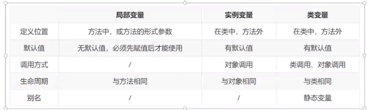
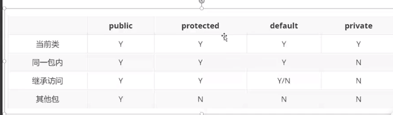
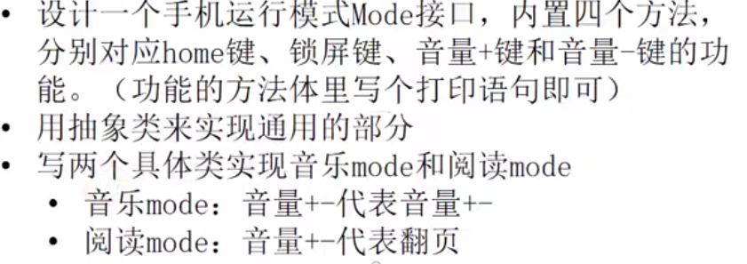

[**回到主页**](http://localhost:3000)

# JAVA

## 命名规则

1. 不能出现空格、@，关键字:48 个关键字：abstract、assert、boolean、break、byte、case、catch、char、class、continue、default、do、double、else、enum、extends、final、finally、float、for、if、implements、import、int、interface、instanceof、long、native、new、package、private、protected、public、return、short、static、strictfp、super、switch、synchronized、this、throw、throws、transient、try、void、volatile、while
2. 区分大小写
3. 可以使用$

## 基本语法

- 方法名应该都以小写字母开头
- 类名的首字母应该大写
- 大小写敏感
- 所有的 Java 程序由 public static void main(String[] args) 方法开始执行
- 方法定义：访问修饰符 返回值 方法名（参数列表）{方法体}
- 在类中定义方法时，如果不加访问修饰符，是默认为类的私有方法(`private`)。

## 数据类型

### 基本数据类型

#### 数值型

- 整数（byte，short，int，long）
- 十进制整数
- 十六进制整数：以 0x 或 0X 开头
- 八进制整数：以 0 开头
- 长整型数：在数字的后面加上 L 或 l

#### 浮点（float，double）

- 表示 float 型要在数字后加 f 或 F
- 表示 double 型要在数字后加 d 或 D，带小数点默认是- 双精度，d 可省略

#### 字符型（char）

#### 布尔型（boolean）

- 占 4 个字符

#### 数据类型间的优先关系：

    byte<short<char<int<float<double

```java
//由低到高会自动转化
int i；
double j = i //将 i 转为 double
// 由高到低需要强制转化
int i = 12;
byte b = (byte)i;//把 i 强制转化为 byte
```

#### 其他类型转换

##### 字符串转数字：

Integer.parseInt(String s);//转换成整型的数值

##### 数字转字符串:

1. Byte.toString(byte b);//字节转字符串
2. String.valueOf(各种类型的数值变量)
3. 用空字符串连接数字，将数字转换为字符串
   eg：“”+25

### 引用数字类型

#### 类（class）

#### 接口（interface）

`interface` 声明，继承 `implement`

#### 数组

##### 一维数组

###### 声明：

类型 数组名[ ] 或类型 [ ] 数组名

eg： `int intArray[ ];//定义一个整型数组 ps：声明数组时不能指定数组中元素个数`

###### 初始化：

**法 1：定义数组时就为元素赋值**

eg：`int intArray[ ] = {1,2,3,4}`

**法 2：用 new 创建**

```java
int a[ ];
a = new int[2];//创建一个有两个元素的 a 数组
a[0] = 1;
a[1] = 2; //为数组赋值
```

##### 二维数组

###### 声明：

`类型 数据名[ ][ ];或类型 [ ][ ] 数组名`

###### 初始化：

与一维类似

java 中允许数组维度不同

##### 枚举（enum）

###### 声明：

`enum 枚举名{ 常量列表 }`

## 控制语句

- if else 同 c 类似
- swich 同 c 类似
- for 同 c 类似
- while 同 c 类似
- do while 语句 同 c 类似
- continue： 跳出本次循环，进入下一个循环；break：结束循环

## 方法和类

### 方法

#### 变量

- 成员变量：在类中声明
- 类变量/静态变量：用 static 声明
- 实例变量
- 局部变量：在方法中声明，**必须初始化**
- 成员变量在整个类内都有效，局部变量只在方法内有效
- 使用 this 关键词可在方法内使用类变量,有点类似于 Python 中的 self
  eg ：

```java
class Tom{
    int x = 98,y;
    void f(){
    ​int  x = 3;
        y = this.x;//y=98
        }
    }
```

- 各变量的区别
  
  **通常不使用对象调用类变量**
  **静态变量通常用于实例共享的变量，例如配置信息**

#### 方法重载：同一个类中有两个方法的名字相同

- 一个类中可以有多个方法具有相同的名字，但这些方法的参数个数或者参数类型必须不同
- 不能以返回值类型作为重载函数的区分标准
- **主要用于适应不同出入口、相同业务功能的方法需要**
- eg：对两个数求和：则可以定义不同的 sum 方法（对 int 求和，对 float 求和等）来对两个变量求和

#### 构造方法：必须和类名相同，不需要声明，可以重载

#### 类方法与实例方法

- 类方法需要 `static` 关键词声明

```java
//eg：
    Class A{
    int a;
    float max(float x,float y){//实例方法
    }
    static min（）{ //类方法
    ​}
    }
```

#### 方法重写

- 是子类对父类允许方法的方法的实现过程重新编写，形参不能改变，可以用`@overwrite` 来修饰，以确保写的方法是重写的方法。
- 参数列表与被重写方法的参数列表必须完全相同
- 返回类型与被重写方法的返回类型可以不相同，但必须是父类返回值的派生类
- 访问权限不能比父类中被重写的方法的访问权限更低
- 声明为 final 的方法不能被重写
- 重写的好处在于子类可以定义特定自己的行为

### 类

Java 中只能有一个主类，含有 main 函数的类是主类

#### 包语句

通过关键字 package 声明包语句，是 Java 源文件的第一条语句
`package 包名；`

#### import 语句

如果一个类想要使用的那个类和他不在一个包中，要使用 import 语句

#### static

静态变量、静态方法、静态常量统称为类的静态成员，归整个类所有，不属于某个单一的对象。调用：`类名.静态成员`

- 被 static 修饰的属性(成员变量)称为静态变量，也叫做类变量；
- 被 static 修饰的常量称为静态常量；
- 被 static 修饰的方法称为静态方法，也叫做类方法；
  **静态方法中不可以使用 this 和 super**
- 被 static 修饰的代码块叫做静态代码块；
- 被 static 修饰符的内部类，叫做静态内部类
- JAVA 中 main 方法是静态的，**如果你想从 main 方法中调用其他方法，这些方法也必须是静态的。**
  eg：main 函数中调用了 print 方法，这就要求 print 方法在定义时，修饰符是 static

```java
import java.util.Scanner;

public class Main {

    public static void main(String[] args) throws Exception {
        Scanner scanner = new Scanner(System.in);
        while (scanner.hasNext()) {
            String className = scanner.next();
            // print就是需要你定义的方法
            print(Class.forName(className).newInstance());
        }
    }

    //write your code here......
    public static void print(Object obj){
        System.out.println(obj.toString());
    }

}
```

#### 继承

- 子类会继承父类所有属性和方法（private 修饰的除外）
- 每个类只能继承一个类
- 所有类都默认继承 Object 类
- 构造对象时，先调用父类构造方法，再调用当前构造方法
- super
  和 this 用法相似，this.可以用于访问当前实例或当前类的构造器；super 用于访问父类的属性或方法，或者指代父类的构造器
- 子类和父类尽量不使用同名字段

#### 访问控制



#### 抽象类

- 抽象类是对一系列看上去不同，但本质上相同的具体概念的抽象
- 声明：public abstract class name
- 抽象类不能被实例化，只有抽象类的非抽象子类可以创建对象
- 抽象类中不一定包含抽象方法，但是有抽象方法的类必定是抽象类
- 抽象类中的抽象方法只是声明，不包含方法体
- 构造方法、类方法不能声明为抽象方法
- 抽象类的子类必须给出抽象类中抽象方法的具体实现，除非改子类也是抽象类
- 应用场景：**当父类中将通用的方法实现后，一些特殊的方法，可以在父类中定义一个抽象方法，逼迫子类去实现**

## 接口

- 声明：`public interface 接口名{}`
- 接口中默认所有方法都是 public
- 接口中没有方法体的方法不需要加 abstract
- 接口中一般用于声明方法，不写方法体
- 接口与抽象类的区别
  - 抽象类中的成员变量可以是各种类型的，而接口中的成员变量只能是 public static final 类型的
  - 一个类只能继承一个抽象类，而一个类可以实现多个接口
- 作业
  

## static 关键字
